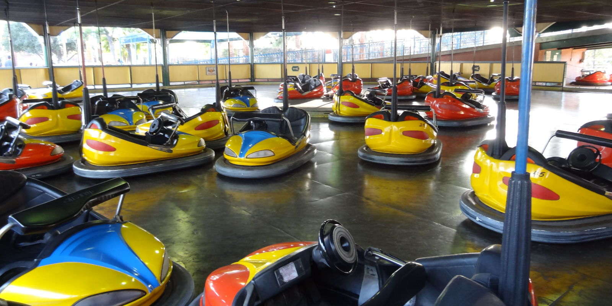

# Autonomous Bumper Cars

## Introduction
The age-old carnival game has fallen out of favor, but it can be brought into the 21st century.  Some of the bumper cars will be fully autonomous, and they will do their best to avoid getting hit by the human drivers.  To make things more interesting, the human drivers will get a reward for hitting an autonomous car, while the autonomous car will get a reward for avoiding the human driver.

## Project Goal
A bumper car arena is a closed area in a rectangular shape with rounded corners (to prevent a car from getting stuck).  There are multiple bumper cars within the arena.  During the session, all cars are moving, though they have no particular place that they need to go.  Many participants aim to run their cars into as many other cars as possible, while some participants try to drive around the arena and not get hit.  The goal of our autonomous bumper cars are to not get hit, though some of the autonomous bumper cars may be set to try to hit others (to make the simulated arena more interesting).  The autonomous bumper car must always be in motion, traveling somewhere within the arena.  It must plot a course that will allow it to avoid being hit.  We may discover strategies for movement that increase the ability to avoid other vehicles acting adversarial to it.

## Level of Autonomy
The autonomous bumper cars will operate under level 5 autonomy.  Bumper cars operate at relatively low speeds within a closed arena and the cars have bumpers and safety equipment that allow collisions to be non-damaging.  While this project will use a simulator, we envision the ability to place the solution within existing bumper car installations.  Humans will be attracted to and will to pay for the opportunity to crash into "robots" and exert their dominance.  This innocent, profitable fun will allow different approaches to collision avoidance to be tested under extreme conditions and the learnings can be applied to actual vehicles running on public roads.

## Description
Existing bumper cars get their electricity using a pole mounted to the rear of the car, as can be seen in the following photo:

Our bumper cars will mount a set of cameras near the top of the pole, with the cameras arranged to allow a 360 degree view of the surroundings.

When all vehicles are in motion, the arena is pure chaos as vehicles travel in any direction and can change trajectory at any time.  Our vehicles will identify all other bumper cars and attempt to guess at the path that they will take.  Our vehicles will plot a path to take that avoids collisions, but the path will need to be adjusted continuously.

-- Be as specific as possible and use diagrams.
-- Lane following with collision avoidance, solving intersections, etc.
-- System overview
-- Present a tentative architecture of the application or diagram to describe your system.  Something can easily describe what the system does.  Inputs, processing, outputs.

## Related Work
-- Mention any projects that inspired this project; do research about other current solutions that can help you

## Team Organization
### Brian Bauer
### David Kalbfleisch

## Software and Development Tools
We will share a private GitHub repository and use it to plan, design, code and document our progress.

## Milestones
### 8 March 2021
Environment set up with arbitrary number of vehicles present (vehicles may be operated by robots or humans)
### 22 March 2021
Robots can identify other vehicles and plot course to avoid all other vehicles
### 5 April 2021
Robots can predict movement of other vehicles and incorporate expected movement into avoidance plan
### 19 April 2021
Some of the robots may be deployed with the desire to hit other vehicles
### 3 May 2021
Presentation of results